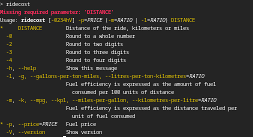

# Ride Cost Command-Line Tool

Mileage-Based Ride Cost Command-Line Tool.

In addition to the [GitLab page][gl-project], this project can also be found on [GitHub][gh-project].

[![Java Version][java-version]][jdk-download]
[![License][license-badge]][license-link]
![GitLab Release][gitlab-release]  
[![GitLab master pipeline][gitlab-master-pipeline]][gitlab-master-pipeline-link]
[![Codacy Badge][codacy-badge]][codacy-badge-link]
[![Codacy Coverage][codacy-coverage]][codacy-coverage-link]  
![GitLab last commit][gitlab-last-commit]
[![Today's hits][today-hits]][today-hits-link]

## Table of Contents

<!--ts-->
   * [How to use](#how-to-use)
      * [How to run](#how-to-run)
      * [Save fuel price and mileage for future use](#save-fuel-price-and-mileage-for-future-use)
   * [Where to get](#where-to-get)
      * [Archlinux](#archlinux)
   * [Contributing](#contributing)
   * [History](#history)
   * [License](#license)

<!-- Created by https://github.com/ekalinin/github-markdown-toc -->
<!-- Added by: r2, at: Fri Nov 14 10:04:16 AM EET 2025 -->

<!--te-->

## How to use

### How to run

To calculate the estimated ride cost, provide the fuel efficiency ratio, fuel price, and distance:

```bash
ridecost -l 6.3 -p 64.99 475
```

where:

* **6.3** - fuel efficiency ratio, in litres per 100 kilometres,
* **64.99** - fuel price,
* **475** - distance to the destination.

Of course, you could use another ratios: miles per gallon, kilometres per litre, gallons per 100 miles.

Full list of options see on the screenshot:  


### Save fuel price and mileage for future use

Starting with version 1.1, you can save the fuel price and mileage using the `--save` or `-s` option:

```bash
ridecost -s -l 6.3 -p 64.99 475
```

After saving, you can run the command with just the distance:

```bash
ridecost 475
```

## Where to get

### Archlinux

Just install the AUR package [ridecost][ridecost-AUR] ☺

## Contributing

Please read [Contributing](contributing.md).

## History

See [Changelog](changelog.md)

## License

```text
Copyright (C) 2024 Vitalij Berdinskih

Licensed under the Apache License, Version 2.0 (the "License");
you may not use this file except in compliance with the License.
You may obtain a copy of the License at

     https://www.apache.org/licenses/LICENSE-2.0

Unless required by applicable law or agreed to in writing, software
distributed under the License is distributed on an "AS IS" BASIS,
WITHOUT WARRANTIES OR CONDITIONS OF ANY KIND, either express or implied.
See the License for the specific language governing permissions and
limitations under the License.
```

See full text [here](LICENSE "the LICENSE file").

[gl-project]: https://gitlab.com/ride-cost/ride-cost-cli

[gh-project]: https://github.com/vitalijr2/ride-cost-cli

[java-version]: https://img.shields.io/static/v1?label=Java&message=17&color=blue&logoColor=E23D28

[jdk-download]: https://www.oracle.com/java/technologies/downloads/#java17

[license-badge]: https://img.shields.io/badge/license-Apache%202.0-blue.svg?style=flat

[license-link]: https://www.apache.org/licenses/LICENSE-2.0.html

[gitlab-release]: https://img.shields.io/gitlab/v/release/ride-cost%2Fride-cost-cli

[gitlab-master-pipeline]: https://gitlab.com/vitalijr2/ride-cost-estimator/badges/master/pipeline.svg

[gitlab-master-pipeline-link]: https://gitlab.com/vitalijr2/ride-cost-estimator/-/commits/master

[codacy-badge]: https://app.codacy.com/project/badge/Grade/f2bc751dc5f1471984210cd22a77b638

[codacy-badge-link]: https://app.codacy.com/gl/ride-cost/ride-cost-cli/dashboard?utm_source=gl&utm_medium=referral&utm_content=&utm_campaign=Badge_grade

[codacy-coverage]: https://app.codacy.com/project/badge/Coverage/f2bc751dc5f1471984210cd22a77b638

[codacy-coverage-link]: https://app.codacy.com/gl/ride-cost/ride-cost-cli/dashboard?utm_source=gl&utm_medium=referral&utm_content=&utm_campaign=Badge_coverage

[gitlab-last-commit]: https://img.shields.io/gitlab/last-commit/ride-cost/ride-cost-cli

[today-hits]: https://hits.sh/github.com/vitalijr2/ride-cost-cli.svg?view=today-total&label=today's%20hits

[today-hits-link]: https://hits.sh/github.com/vitalijr2/ride-cost-cli/

[ridecost-AUR]: https://aur.archlinux.org/packages/ridecost/
